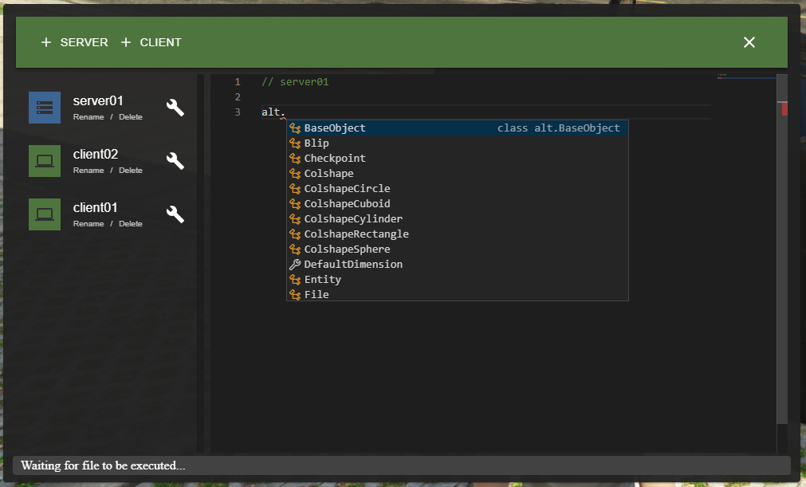

# altV-vCode

A server/client-sided editor made for alt:V MP and powered by the [Monaco Editor](https://microsoft.github.io/monaco-editor/index.html)

### Tools were used to create in-game editor

-   React
-   MobX

## Requirments

-   [NodeJS](https://nodejs.org/en/download/current/)
-   [Enable ESM](https://nodejs.org/api/esm.html)

To enable ESM module, you need to have `package.json` file and to create it please follow [Creating a package.json file](https://docs.npmjs.com/creating-a-package-json-file).

## Installation

Download [the latest release](https://github.com/5exyGuy/altv-vcode/releases/tag/1.2) ant put it in the resources folder.

## Usage

### Features

| Feature   |                           Action                           |
| --------- | :--------------------------------------------------------: |
| Drag      |                  Drags the opened window                   |
| Resize    |                 Resizes the opened window                  |
| Shortcuts | Gives ability to manage files with specified key shortcuts |

### Config

The resource has a configuration file where you can change key shortcuts or disable them by commenting them out.
The configuration file can be found in the resource folder `config.js`.

```javascript
// JavaScript Event KeyCodes https://keycode.info/

const config = {
    DEBUG: false, // Don't change it. It's used only for development purposes.
    DEFAULT_WIDTH: 1000,
    DEFAULT_HEIGHT: 600,
    DEFAULT_POSITION_X: 100,
    DEFAULT_POSITION_Y: 100,
    TOGGLE_EDITOR: 115, // Default: F4
    RENAME_CURRENT_FILE: 113, // Default: F2
    CREATE_NEW_SERVER_FILE: 116, // Default: F5
    CREATE_NEW_CLIENT_FILE: 117, // Default: F6
    EXECUTE_CURRENT_FILE: 118, // Default: F7
    DELETE_CURRENT_FILE: 46, // Default: Delete
    CLOSE_EDITOR: 27, // Default: Esc
};

export default config;
```

## Preview



## Known issues

-   It may take some time to load webview, because after player connection typings are sent to webview from the server.
-   ~~The monaco editor is not visible after the first opening. To fix it, it is necessary everytime to resize the window.~~
